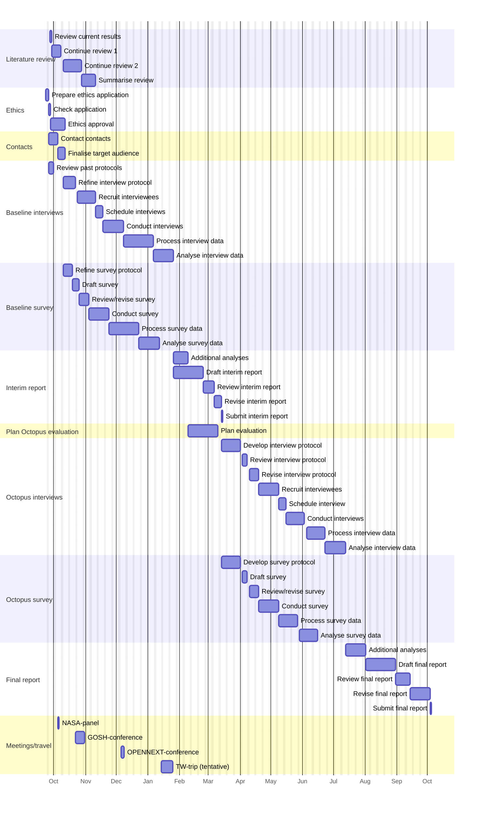

# Evaluation timeline

Draft of Octopus evaluation timeline.

```mermaid
gantt
    dateFormat YYYY-MM-DD
    excludes weekends
    axisFormat %b
    todayMarker off
    
    section Literature review
    Review current results     :l-sitrep, 2022-09-27, 2d
    Continue review 1          :l-rvw-1, after l-sitrep, 7d
    Continue review 2          :l-rvw-2, after l-rvw-1, 14d
    Summarise review           :l-summary, after l-rvw-2, 10d
    
    section Ethics
    Prepare ethics application :e-prep, 2022-09-23, 2022-09-26
    Check application          :e-check, after e-prep, 2d
    Ethics approval            :ethics, after e-check, 10d
    
    section Contacts
    Contact contacts           :contact, 2022-09-26, 7d
    Finalise target audience   :target, after contact, 5d
    
    section Baseline interviews
    Review past protocols      :review, 2022-09-26, 5d
    Refine interview protocol  :b-ritv, after review l-rvw-1, 10d
    Recruit interviewees       :b-recruit, after ethics b-ritv, 14d
    Schedule interviews        :b-sch, after b-recruit, 5d
    Conduct interviews         :b-itv, after b-sch, 14d
    Process interview data     :b-pitv, after b-itv, 21d
    Analyse interview data     :b-aitv, after b-pitv, 14d
    
    section Baseline survey
    Refine survey protocol     :b-rsp, after review l-rvw-1, 7d
    Draft survey               :b-dsr, after b-rsp, 5d
    Review/revise survey       :b-rsr, after b-dsr, 7d
    Conduct survey             :b-sr, after ethics b-rsr, 14d
    Process survey data        :b-psr, after b-sr, 21d
    Analyse survey data        :b-asr, after b-psr, 14d
    
    section Interim report
    Additional analyses        :b-analyse, after b-aitv b-psr, 10d
    Draft interim report       :dir, after l-summary b-aitv b-asr, 21d
    Review interim report      :rvir, after dir, 7d
    Revise interim report      :rir, after rvir, 5d
    Submit interim report      :after rir, 1d
    
    section Plan Octopus evaluation
    Plan evaluation            :o-plan, after b-analyse, 21d

    section Octopus interviews
    Develop interview protocol :o-ditv, after o-plan rir, 14d
    Review interview protocol  :o-rvitv, after o-ditv, 5d
    Revise interview protocol  :o-ritv, after o-rvitv, 7d
    Recruit interviewees       :o-recruit, after ethics o-ritv, 14d
    Schedule interview         :o-sch, after o-recruit, 5d
    Conduct interviews         :o-itv, after o-sch, 14d
    Process interview data     :o-pitv, after o-itv, 14d
    Analyse interview data     :o-aitv, after o-pitv, 14d
    
    section Octopus survey
    Develop survey protocol    :o-dsp, after o-plan rir, 14d
    Draft survey               :o-dsr, after o-dsp, 5d
    Review/revise survey       :o-rsr, after o-dsr, 7d
    Conduct survey             :o-sr, after ethics o-rsr, 14d
    Process survey data        :o-psr, after o-sr, 14d
    Analyse survey data        :o-asr, after o-psr, 14d
    
    section Final report
    Additional analyses        :o-analyse, after o-aitv o-asr, 14d
    Draft final report         :dfr, after o-analyse, 21d
    Review final report        :rvfr, after dfr, 10d
    Revise final report        :rfr, after rvfr, 14d
    Submit final report        :after rfr, 1d
  
    section Meetings/travel
    NASA-panel                 :nasa, 2022-10-05, 2022-10-06
    GOSH-conference            :gosh, 2022-10-22, 2022-10-31
    OPENNEXT-conference        :on, 2022-12-06, 2022-12-09
    TW-trip (tentative)        :tw, 2023-01-14, 2023-01-25
```